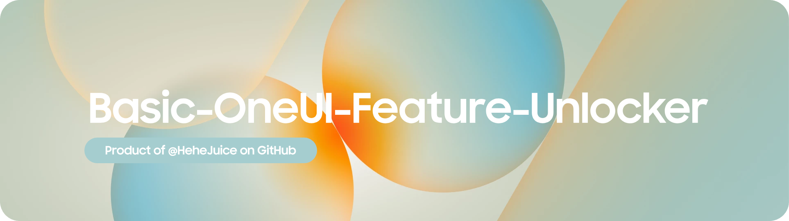

<h1 align="center">
  
</h1>

## 🗺️ Basic-OneUI-Feature-Unlocker
- A Magisk Module That Auto Unlock More Features By Modifying `floating_feature.xml` and `system.prop`
- Support ALL Galaxy Devices running `OneUI 5 and UP`
- Auto Value Change Depends on Device

#### ✅ Added the following 
 * Add `Google` ,`Bixby Home CN` and `Samsung News` Support to -1 Page
 * Add `Interview` and `Voicemono` to Samsung Recorder
 * Add `Extra Dim Mode`
 * Apply `CNHighEnd` Animation
 * Restore `Clock Transition` and `Active Clock` for AOD devices
 * Restore `Screen Recorder`
 * Unlocks `High Performance Mode` and `Enhanced CPU Responsiveness Options`
 * Unlock `Frame Effects` From Flagship
 * Unlock `Camera Privacy Toggle`
 * Unlock `Camera OCR V2`
 * Unlock `Up to 5 Multi Users`
 

